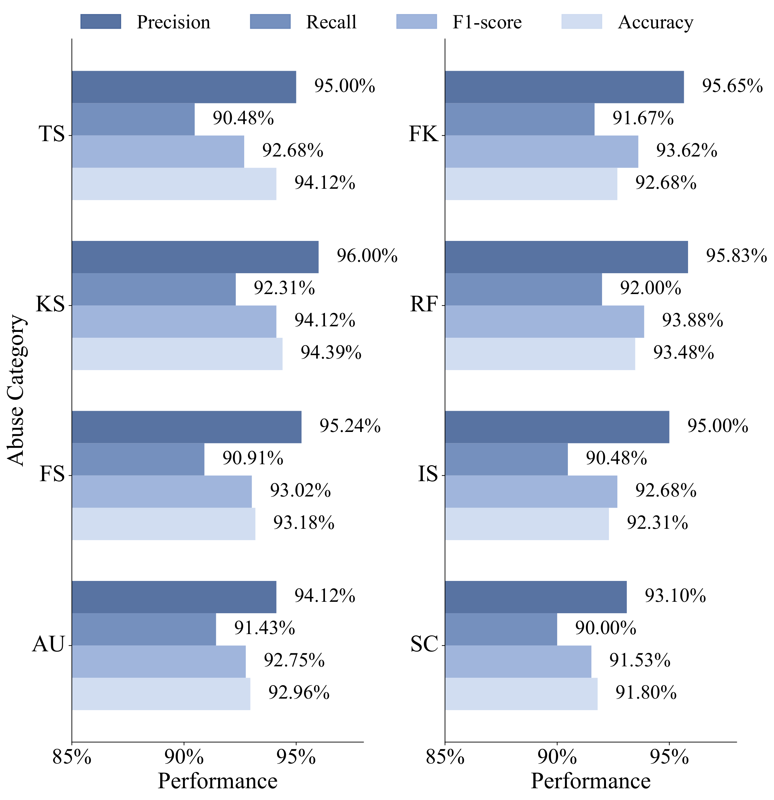
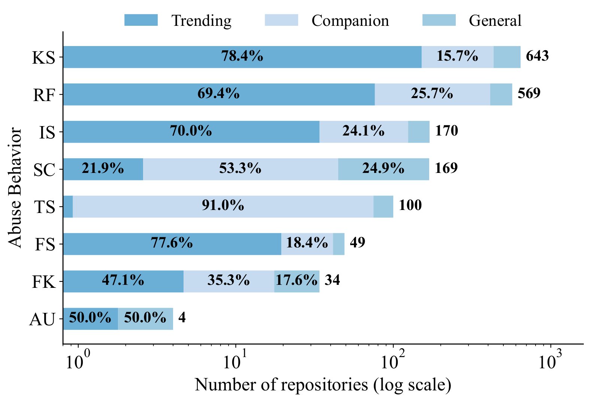
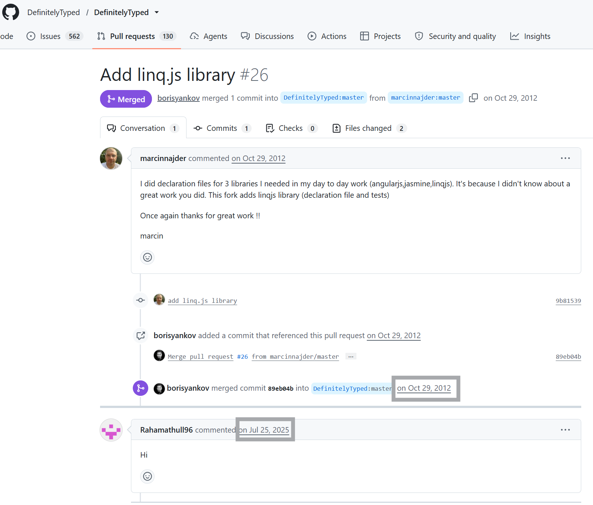
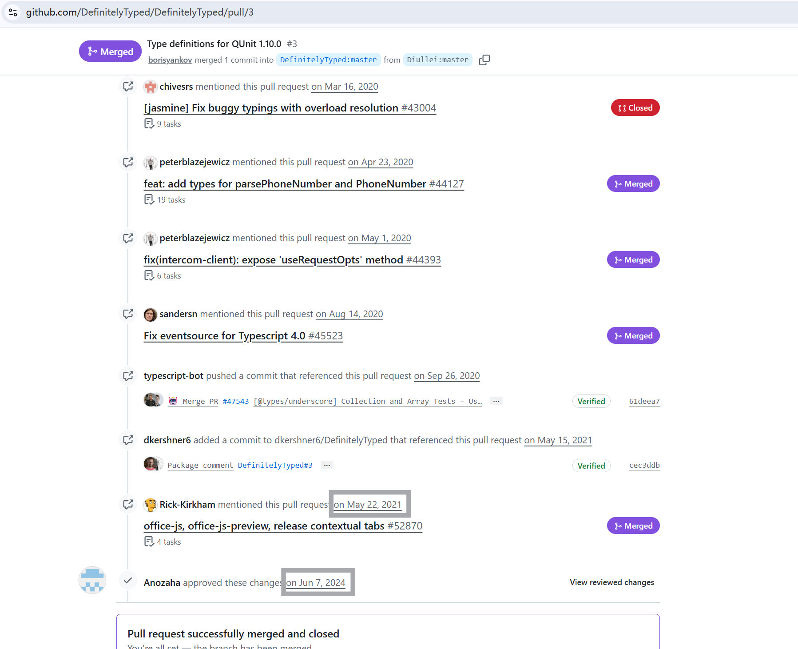
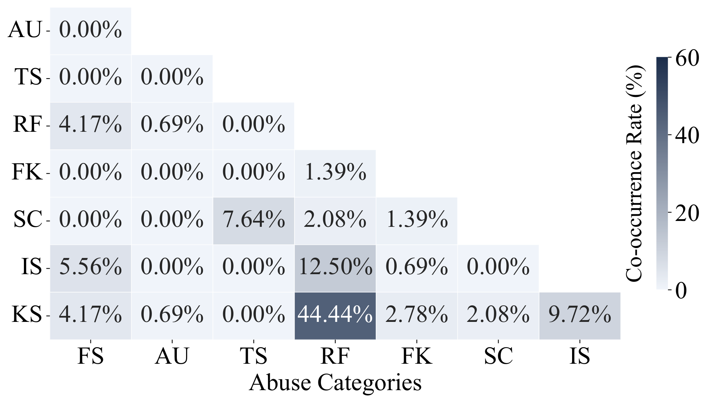
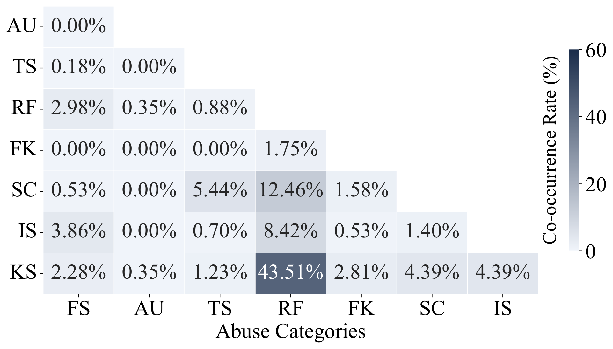
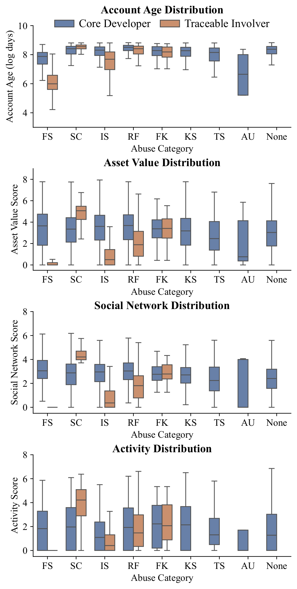
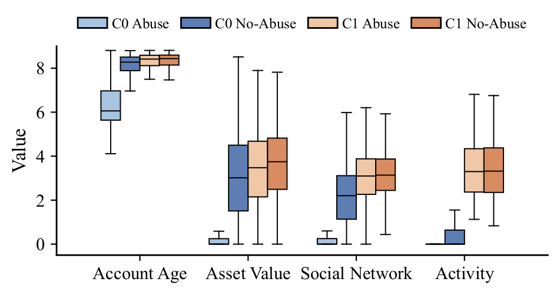

# GitHub-Cleaner

## TL;DR

Open-source hosting platforms are increasingly targeted by *abuse behaviors*, i.e., malicious
activities that exploit open collaboration channels and reputation systems rather than code-level
vulnerabilities, in order to distort platform metrics, disrupt development, and deceive legitimate
developers. This work presents the first large-scale empirical study of such behaviors on GitHub.
We distill a taxonomy of eight representative abuse behaviors across three categories, characterize
their observable symptoms, and implement **SPREAD** (**S**ym**P**tom-d**R**iv**E**n **A**buse
**D**etection), a framework that turns each symptom into a computable detector.

This repository contains the complete artifact behind the study: the two collection pipelines that
build the repository and developer datasets, the SPREAD detection framework with its bundled
corpora and pretrained classifier, the released datasets — the 12,000-repository scanning corpus
with its detection verdicts, the labeled benchmark, the manual-verification tables and the
developer profiles — and the analysis results reported for each research question.

| Scale                       | Value                                                                                                                                   |
| --------------------------- | --------------------------------------------------------------------------------------------------------------------------------------- |
| Repositories scanned        | 12,000 (4,000 Trending, 4,000 Companion, 4,000 General)                                                                                 |
| Developer accounts profiled | 56,735                                                                                                                                  |
| Abuse behaviors covered     | 8, across 3 categories                                                                                                                  |
| Detection performance       | > 90% precision, recall, F1 and accuracy on a 460-instance labeled benchmark; 97.06% accuracy on 442 manually verified real-world cases |

## Repository Structure

```
- data_collect_repo/            # Repository collection pipeline (Trending / Companion / General)
    - collector.py              # Driver: module registry, incremental collection, state tracking
    - collectors/               # One module per source (trending, topics, collections,
                                #   accompanying, ossf_scorecard, ossf_criticality, core_developers)
    - get_scorecard.py          # Regenerates the OpenSSF Scorecard export from BigQuery
    - datasets/                 # Compressed collection inputs + SHA256SUMS (see its README)
- data_collect_developers/      # Developer collection pipeline
    - main.py                   # Driver over the three user collectors
    - collectors/               # Repository contributors, GitHub Leaderboard, GitStar Ranking
    - filter_users.py           # Follower-threshold filter producing the well-known developer corpus
    - user_characteristics.py   # Per-account age, asset, social and activity metrics
    - datasets/                 # Compressed user records + SHA256SUMS (see its README)
- detect_frame/                 # SPREAD detection framework
    - github_abuse_detector.py            # Detector implementations and single-repository CLI
    - github_abuse_detector_pipeline.py   # Resumable batch pipeline over a JSON dataset
    - github_abuse_detector_verification.py  # Re-runs one declared category per CSV row
    - core_*.py                 # Detection cores of the eight abuse behaviors
    - detect_clean.py           # Dataset self-deduplication
    - detect_extract.py         # Balanced sampling of the three repository groups
    - detect_with_failed.py     # Rescans repositories missing from an output file
    - detect_postprocess.py     # Precision-oriented re-judgment of the raw verdicts
    - build_corpus.py           # Builds the BM25 reference collection from README documents
    - improved_similarity.py    # Name and README similarity metrics
    - corpus_*.json             # Bundled corpora (popular repositories, well-known developers, BM25)
    - fake_star_scan_data/      # Pre-computed low-activity stargazer scans and their SQL
    - mlartifacts/              # Pretrained issue-spam classifier (Git LFS / release asset)
    - config.json               # Per-detector tokens, thresholds and API settings
- dataset/                      # Released datasets (see "Dataset")
- experimental_results/         # Per-RQ analysis results (see "Analysis Results")
    - RQ1/  RQ2/  RQ3/  RQ4/
- README.md
```

## Taxonomy of Abuse Behaviors

The taxonomy is organized around the GitHub functional modules the behaviors exploit. Each behavior
is paired with an observable symptom, and each symptom with one detector module. The thresholds
below are the calibrated defaults shipped in `detect_frame/config.json`.

| Category               | Abuse behavior           | Detector module         | Involver              | Calibrated defaults                                                   |
| ---------------------- | ------------------------ | ----------------------- | --------------------- | --------------------------------------------------------------------- |
| Discovery Manipulation | Fake Stars (FS)          | `fake_stars`          | Repository, Developer | ≤ 2 actions on a single day, ≥ 10% of inspected stargazers          |
| Discovery Manipulation | Automatic Updates (AU)   | `automatic_updates`   | Repository            | ≥ 10 commits / 24 h, ≤ 5 changed lines on average                   |
| Discovery Manipulation | Keyword Stuffing (KS)    | `keyword_stuffing`    | Repository            | > 5 topics with BM25 score < 2.0                                      |
| Discovery Manipulation | Typo Squatting (TS)      | `typo_squatting`      | Repository            | name and README similarity ≥ 0.7, ≥ 2× stars and forks             |
| Collaboration Abuse    | Issue Spam (IS)          | `issue_spam`          | Repository, Developer | ≥ 5 issues classified as spam                                        |
| Collaboration Abuse    | Reputation Farming (RF)  | `reputation_farming`  | Repository, Developer | interaction ≥ 400 days after close/merge, ≥ 5 instances             |
| Credential Forgery     | Spoofed Contributor (SC) | `spoofed_contributor` | Repository            | ≤ 1,000 stars and forks, ≤ 2 commits by a well-known developer      |
| Credential Forgery     | Fake Stats (FK)          | `fake_stats`          | Developer             | claimed stars > 5× the observed sum, or third-party statistics cards |

## Setup

All reported experiments were run on Python 3.12 (Windows 11, Intel i7-12700H, 16 GB RAM).

1. Clone the repository. [Git LFS](https://git-lfs.com) must be installed beforehand, as the
   pretrained `issue_spam` model is distributed as an LFS object:

   ```bash
   git lfs install
   git clone https://github.com/Rasnd-yu/GitHub_Cleaner.git
   cd GitHub_Cleaner
   ```

   If the repository was cloned before Git LFS was installed, materialize the model artifact with
   `git lfs pull`, or download it from the release as described in
   [Pretrained Model](#pretrained-model).
2. Install the dependencies:

   ```bash
   pip install requests urllib3 numpy scikit-learn rank-bm25 rapidfuzz
   ```

   Three collectors need additional packages, which are only required if the corresponding
   collection step is re-executed: `beautifulsoup4` and `selenium` with `webdriver-manager`
   (GitStar Ranking and GitHub Leaderboard seeds), `python-frontmatter` (Topics and Collections
   snapshots), and `google-cloud-bigquery` (`data_collect_repo/get_scorecard.py`).

   The `issue_spam` classifier is cloudpickle-serialized; deserializing it requires the
   scikit-learn and NumPy versions pinned in the `requirements.txt` shipped inside the MLflow
   artifact directory (Python 3.11.6, scikit-learn 1.5.0).
3. Provide GitHub credentials. `detect_frame/config.json` ships with `"xxx"` placeholders, which
   must be replaced by personal access tokens before any detector issues API traffic. The
   `fake_stars` and `reputation_farming` detectors accept a list under `github_tokens` and rotate
   over it, switching proactively before the REST and Search rate limits are reached; the remaining
   detectors read a single `github_token`. The two collection pipelines carry their own credentials
   in `data_collect_developers/config.py` and in the `MODULE_CONFIG` block of each module under
   `data_collect_repo/collectors/`.

## Dataset

### Collection Pipelines

The dataset is built from three complementary sources that span different tiers of visibility, and
each collected record retains a `source` field naming its exact origin, so that the sampling frame
is reproducible rather than merely described.

- **Trending repositories** — the most visible and actively maintained projects, collected from
  GitHub's daily Trending pages over Jan. 1 – Dec. 31, 2025 (top 5 per language) and supplemented
  with the top 10 repositories of every official Collection and Topic
  (`collectors/trending_*.py`, `collectors/collections.py`, `collectors/topics.py`).
- **Companion repositories** — derivative or auxiliary projects (plugins, wrappers, promotional
  clones) retrieved by using the names of trending repositories as search queries and excluding the
  trending repository itself (`collectors/accompanying.py`).
- **General repositories** — the baseline of the broader platform, sampled from the OpenSSF
  Scorecard and Criticality Score datasets, which cover over one million actively maintained
  projects (`collectors/ossf_scorecard.py`, `collectors/ossf_criticality.py`).

Deleted and private repositories are excluded, collection is incremental with per-module state
tracking, and deduplication is enforced on `full_name`. `collectors/core_developers.py` and its
enricher attach the core contributor list of every repository, following the definition of prior
work on core developer identification.

The developer pipeline (`data_collect_developers/`) resolves the accounts connected to those
repositories, seeds a high-reputation corpus from the GitHub Leaderboard and GitStar Ranking, keeps
the accounts above a 1,000-follower threshold as the well-known developer corpus
(`filter_users.py`), and collects the per-account age, asset, social-network and activity metrics
used in RQ4 (`user_characteristics.py`).

Both pipelines read compressed inputs that are versioned alongside them, with extraction commands
and SHA-256 digests documented in
[`data_collect_repo/datasets/README.md`](data_collect_repo/datasets/README.md) and
[`data_collect_developers/datasets/README.md`](data_collect_developers/datasets/README.md). The
trending, topics and collections snapshots are point-in-time observations that a later crawl cannot
reconstruct, which is why they are archived rather than re-fetched.

### Released Data

The four JSON datasets are versioned gzip-compressed, since their expanded form amounts to 228 MB
and one of them exceeds GitHub's 100 MB per-file limit for regular Git objects. Expand them with
`gunzip -k dataset/*.json.gz`; digests for every file are recorded in `dataset/SHA256SUMS`, and
[`dataset/README.md`](dataset/README.md) documents the field-level schema.

| File                                      | Description                                                                                                                                                                                                                             |
| ----------------------------------------- | --------------------------------------------------------------------------------------------------------------------------------------------------------------------------------------------------------------------------------------- |
| `dataset/source_github_repos.json.gz`   | The collected repository pool, including the 13,368 Trending, 13,503 Companion and 12,136 General repositories of the study. Each record carries the full repository object, its`source` provenance and the `core_developers` list. |
| `dataset/experiment_input.json.gz`      | The scanning corpus drawn from that pool, 4,000 repositories per group. Input of the detection pipeline.                                                                                                                                |
| `dataset/experiment_output.json.gz`     | The same records extended with the per-detector verdicts and their supporting observations (`abuse_count`, `abuse_categories`, `abuse_details`). Output of the pipeline after post-processing.                                    |
| `dataset/user_characteristics.json.gz`  | Age, asset, social-network and activity metrics of the accounts connected to the scanned repositories, including the 56,735 accounts profiled in RQ4.                                                                                   |
| `dataset/threshold_calibration.csv`     | The 300 manually labeled cases (149 abuse / 151 benign) over which the thresholds were calibrated. Disjoint from the benchmark below.                                                                                                   |
| `dataset/baseline_detection_output.csv` | The labeled benchmark of 460 instances (230 abuse / 230 benign), with the manual label`m_label` and the framework verdict `detect_label`.                                                                                           |
| `dataset/detection_verify_abuse.csv`    | The 221 flagged-abuse cases inspected manually, with the adjudicated outcome in`verify`.                                                                                                                                              |
| `dataset/detection_verify_benign.csv`   | The 221 matched benign controls, with the manual verdict.                                                                                                                                                                               |

The JSON datasets are released as collected, so they cover more than the study analyzes: the paper
works on a fixed subset and excludes suspended, deleted and bot accounts.

## Detection Framework

SPREAD takes GitHub repositories as input and determines the presence of each abuse behavior in two
stages. **Metadata extraction** gathers the multi-granularity evidence a symptom needs — repository
attributes such as README content, declared topics, star and fork counts and commit history;
interaction footprints across issues and pull requests; and the profiles and self-reported
statistics of the accounts connected to the repository. **Symptom identification** then evaluates
the symptom formulas over that evidence and emits a binary verdict per behavior, together with the
structured observations that produced it, so that no decision has to be accepted on trust. A final
post-processing stage re-judges the raw verdicts under stricter criteria.

### Detectors

Each detector reports a verdict together with the observations that produced it, so that no decision
has to be accepted on trust. Their evidence and decision rules are summarized below; the exact
thresholds and API settings live in `config.json`, and the reasoning behind each rule is documented
in the corresponding `core_*.py`.

- **Fake stars** (`fake_stars`) — Characterizes the accounts that granted the stars rather than the
  star count itself, flagging a repository when a sufficient share of its stargazers are throwaway
  accounts whose entire public activity collapses into a single day around the star event.
- **Automatic updates** (`automatic_updates`) — Separates genuine development from cosmetic commit
  inflation by pairing commit frequency with commit magnitude within a short window: many commits,
  almost no changed lines.
- **Typo-squatting** (`typo_squatting`) — Proceeds from lexical proximity to semantic duplication,
  reporting a repository whose name and README both closely match a far more popular counterpart.
  Well-known organizations, forks, mirrors and `awesome`-style lists are excluded a priori.
- **Reputation farming** (`reputation_farming`) — Targets contribution activity whose timing betrays
  its purpose, collecting reviews and comments issued long after a pull request was merged or
  closed, and judging their substance by length and templated approval patterns.
- **Fake statistics** (`fake_stats`) — Audits the profile READMEs of a repository's core developers,
  comparing the star totals they advertise against the sum actually observed across their
  repositories, and reporting statistics cards that render a third party's numbers once same-person
  accounts and acknowledged collaborations have been ruled out.
- **Spoofed contributors** (`spoofed_contributor`) — Examines whether prominence in a contributor
  list is earned, intersecting the contributor lists of small or recent repositories with a corpus
  of well-known developers and reporting matches whose commit count is negligible.
- **Issue spam** (`issue_spam`) — Classifies the title and body of a repository's issues with the
  pretrained model described in [Pretrained Model](#pretrained-model), and aggregates the
  predictions per author and per repository.
- **Keyword stuffing** (`keyword_stuffing`) — Assesses whether the topics a repository declares are
  supported by its documentation, scoring every declared topic against a pre-built reference
  collection with BM25. Repositories without topics or with a near-empty README are left unjudged
  rather than presumed benign.

### Bundled Corpora

Three detectors are backed by corpora shipped with the repository, which keeps the expensive
comparisons offline and reproducible:

| Corpus                                 | Content                                                                        | Used by                                                  |
| -------------------------------------- | ------------------------------------------------------------------------------ | -------------------------------------------------------- |
| `corpus_repos_hot.json`              | Popular repositories drawn from the Trending pool                              | Typo Squatting (candidate victims)                       |
| `corpus_developers_famous.json`      | 2,723 high-reputation accounts derived from leaderboards and trending projects | Spoofed Contributor (identity matching, post-processing) |
| `corpus_keyword_stuffing.json`       | The tokenized README reference collection                                      | Keyword Stuffing (BM25 scoring)                          |
| `corpus_keyword_stuffing_input.json` | The 3,000 README documents behind it, 1,000 sampled per group                  | Source of the BM25 collection                            |
| `fake_star_scan_data/`               | Pre-computed low-activity stargazer scans and`scan.sql`                      | Fake Stars (offline resolution)                          |

The BM25 collection is rebuilt from the input sample with `build_corpus.py`, which fetches missing
READMEs from the GitHub API and caches them on disk across runs. `scan.sql` is the ClickHouse query
over the public GitHub event archive that produces the low-activity stargazer scans.

### Running the Detector

**Batch pipeline.** Runs all eight detectors over a JSON dataset. Execution is resumable: progress
is written live, so an interrupted run continues where it stopped unless `--force` is given. The
released corpus must be expanded first (`gunzip -k dataset/experiment_input.json.gz`).

```bash
cd detect_frame
python github_abuse_detector_pipeline.py \
  --input ../dataset/experiment_input.json \
  --output ../dataset/experiment_output_raw.json \
  --config config.json --csv
```

| Option               | Meaning                                                     |
| -------------------- | ----------------------------------------------------------- |
| `--input`, `-i`  | Input JSON dataset (a list of repository records)           |
| `--output`, `-o` | Output JSON file, extended with the per-repository verdicts |
| `--config`, `-c` | Configuration file (default`config.json`)                 |
| `--max`, `-m`    | Maximum number of repositories to process                   |
| `--csv`            | Additionally emit a flat CSV of the verdicts                |
| `--force`, `-f`  | Restart from scratch, ignoring existing progress            |
| `--single`, `-s` | Process one repository given as a JSON record or a URL      |

**Single repository.** Runs one or all detectors on an individual target.

```bash
python github_abuse_detector.py --category keyword_stuffing --repo repo_record.json
```

Every detector consumes the same repository record, so `--repo` expects a GitHub repository object
as returned by the API and stored in the released datasets. The developer-level behaviors are
resolved from that record as well: `fake_stats` audits the profiles listed in its `core_developers`
field, and `reputation_farming` aggregates the late interactions found on the repository's pull
requests per account. Omitting `--category` runs all eight detectors and reports one verdict each.

**Supporting steps.** `detect_clean.py` deduplicates a dataset against itself,
`detect_extract.py` draws the balanced 4,000-per-group scanning corpus with a fixed random seed,
`detect_with_failed.py` compares an input and an output file and rescans the repositories that are
missing, and `github_abuse_detector_verification.py` re-runs a single declared category per row of
a CSV — the way the labeled benchmark and the verification tables were produced — with its input,
metadata and output paths set at the top of its `main()`.

**Post-processing.** `detect_postprocess.py` re-judges the raw output under stricter criteria so
that the reported verdicts favor precision over recall: reputation farming and issue spam require
at least five confirmed instances, and spoofed contributors are retained only when corroborated by
the well-known developer corpus.

```bash
python detect_postprocess.py \
  --input ../dataset/experiment_output_raw.json \
  --output ../dataset/experiment_output.json \
  --corpus corpus_developers_famous.json
```

A statistics report comparing the raw and re-judged verdicts is written to `detect_pipeline_log/`
next to the input file.

### Pretrained Model

The `issue_spam` detector relies on a pretrained classifier that ships with the repository as a
[Git LFS](https://git-lfs.com) object, since the artifact exceeds the 100 MB per-file limit that
GitHub imposes on regular Git objects. Until `git lfs pull` has been executed, the path below
holds a text pointer rather than the model, and the detector reports `Model loading failed`.

The same artifact is attached to the [`model-v1.0`](https://github.com/Rasnd-yu/GitHub_Cleaner/releases/tag/model-v1.0)
release, byte-for-byte identical to the tracked copy. Downloading it from there avoids Git LFS
altogether, which matters for two reasons: the source archives generated for a release contain
only the LFS pointer, and release assets are exempt from the Git LFS bandwidth allowance.

```bash
curl -L -o detect_frame/mlartifacts/2/0579ea92a6c7494e9bfdf42813fe3867/artifacts/nn/model.pkl \
  https://github.com/Rasnd-yu/GitHub_Cleaner/releases/download/model-v1.0/issue_spam_model_v1.0.pkl
```

| Property    | Value                                                                                  |
| ----------- | -------------------------------------------------------------------------------------- |
| Path        | `detect_frame/mlartifacts/2/0579ea92a6c7494e9bfdf42813fe3867/artifacts/nn/model.pkl` |
| Format      | MLflow 2.13.2 model,`sklearn` flavor, `cloudpickle` serialization                  |
| Environment | Python 3.11.6, scikit-learn 1.5.0                                                      |
| Size        | 244,530,530 bytes (233 MiB)                                                            |
| SHA-256     | `d4943e1812c51a65cafd7ea71cb9aebdaa73a570a16231d7bc5b856b78d9baf2`                   |
| MLflow run  | `0579ea92a6c7494e9bfdf42813fe3867`, created 2024-06-19 19:51:59 UTC                  |

The artifact directory retains the complete MLflow descriptor (`MLmodel`, `conda.yaml`,
`python_env.yaml`, `requirements.txt`), so the inference environment can be reconstructed exactly.
The integrity of the retrieved artifact can be verified against the digest above:

```bash
sha256sum detect_frame/mlartifacts/2/0579ea92a6c7494e9bfdf42813fe3867/artifacts/nn/model.pkl
```

The model location is resolved through the `model_path` key of the `issue_spam` detection
configuration, so an alternative copy can be supplied without modifying the source.

## Analysis Results

`experimental_results/` holds the results reported for each research question. Every figure is kept
in vector form for the paper and rendered to PNG for display here; the labeled and manually
verified tables supporting RQ1 accompany the figure they belong to.

### RQ1 — Effectiveness of the detection framework

<p align="center">
  
</p>

The framework is evaluated from two complementary perspectives. On a labeled benchmark of 460
instances balanced between abuse and benign cases, and disjoint from the set used to calibrate the
thresholds, all four metrics stay above 90% for every one of the eight behaviors. Keyword Stuffing
and Reputation Farming attain the highest F1 scores, as their symptoms are directly observable in
repository metadata, whereas Spoofed Contributor is the hardest case: well-known developers
occasionally offer light, informal help, which is difficult to separate from deliberate identity
appropriation. Typo Squatting and Issue Spam follow, since low-popularity look-alikes are sometimes
genuine efforts and spam issues often masquerade as vulnerability reports.

The framework is then applied in the wild and its verdicts inspected manually: 221 flagged-abuse
cases across the eight categories, together with 221 flagged-benign cases as negative controls,
checked independently by two experts with high initial agreement (Cohen's κ = 0.82) and adjudicated
by a third. Accuracy reaches 97.06% overall, 94.57% on the flagged-abuse cases and 99.55% on the
benign controls. Automatic Updates is the weakest category, because synchronization scripts and
CI/CD pipelines occasionally produce the same bursty, trivial commits the symptom describes. The
per-category outcomes are recomputable from the two verification tables in `RQ1/`.

### RQ2 — Prevalence across repository ecosystems

<p align="center">
  
</p>

Abuse is uncommon in absolute terms — 13.37% of the scanning corpus carries at least one behavior —
but distributed highly unevenly across ecosystems. Trending repositories are flagged at 25.30%,
against 11.50% for Companion and 3.30% for General repositories, which identifies visibility as a
primary risk factor: it rewards owners for inflating their own discovery signals and simultaneously
attracts externally initiated attacks seeking an audience. Keyword Stuffing and Reputation Farming
dominate the behavior mix, both being low-cost, low-risk and easily automated. Trending repositories
concentrate the attention-manipulation behaviors, with relative risks against General repositories
reaching 19× for Fake Stars, while Companion repositories are enriched in the identity-oriented
ones, Typo Squatting above all, since mimicking a popular project is precisely how they blend into
its ecosystem.

**Case study — Reputation Farming on legacy pull requests.** Two pull requests legitimately merged
into `DefinitelyTyped` in October 2012 became targets of meaningless engagement more than a decade
later: a trivial "Hi" comment on one, and a formal approval of the other. Such interactions cost
nothing yet insert their authors into the participant list of a globally recognized repository,
where GitHub records them in the account's public timeline as sustained engagement.

<p align="center">
  
  
</p>

### RQ3 — Co-occurrence of abuse behaviors

<p align="center">
  
  
</p>

Co-occurrence is examined at both the repository and the developer level. Globally it is rare —
7.73% of the abusive repositories and 1.17% of the involved accounts engage in more than one
behavior, and pairwise associations are negligible (|φ| ≤ 0.08) — which indicates that abuse largely
operates in isolation rather than as coordinated campaigns. Where it does occur, however, it is
sharply concentrated: three quarters of the multi-abuse repositories are Trending, and core
developers rather than disposable executing accounts dominate the multi-abuse population. Within
that subset Keyword Stuffing paired with Reputation Farming is by far the most frequent combination
at both levels, followed by Issue Spam with Reputation Farming, a pattern consistent with popular
projects attracting both self-promotion and low-cost collaboration abuse.

### RQ4 — Characteristics of the involved accounts

<p align="center">
  
</p>

Accounts are profiled along four dimensions — account age, asset value, social network and activity
frequency — separately for the core developers of a flagged repository and for the involvers that
carry out the traceable action. Most behaviors show a clear role stratification: core developers are
long-lived, asset-rich and active, whereas involvers behave as disposable instruments with short
lifespans, few assets and weak social ties. Spoofed Contributor inverts the picture, because there
the involvers are the impersonated reputable developers, i.e., the victims. For the behaviors
without a traceable involver, Keyword Stuffing owners are statistically indistinguishable from the
abuse-free baseline, and Typo Squatting owners differ only in asset value.

<p align="center">
  
</p>

Unsupervised clustering over the same dimensions recovers two populations. The low-profile cluster
holds accounts with limited assets, influence and activity; its abusive members act overwhelmingly
as involvers executing Fake Stars and form a compact, easily isolable group. The established cluster
holds accounts with substantial assets and influence, dominated by Reputation Farming and Keyword
Stuffing, and here the abusive and non-abusive accounts overlap heavily across all four dimensions.
Reputation-oriented abuse is therefore orchestrated by accounts that profile metadata alone cannot
separate from legitimate developers.

## Reproducing the Study

0. **Expand the released datasets.** `gunzip -k dataset/*.json.gz`, optionally verifying them
   against `dataset/SHA256SUMS` first.
1. **Rebuild the datasets** (optional; the released datasets under `dataset/` are the exact inputs
   and outputs of the reported study). Extract the collection inputs as documented in the two
   `datasets/README.md` files, then run `python collector.py` in `data_collect_repo/` and
   `python main.py` in `data_collect_developers/`.
2. **Draw the scanning corpus.** `detect_frame/detect_extract.py` samples 4,000 repositories per
   group under a fixed seed, keeping the input and output files in correspondence.
3. **Run the detection pipeline** over `dataset/experiment_input.json` as shown above, then apply
   `detect_with_failed.py` for repositories missed due to transient API failures and
   `detect_postprocess.py` for the final verdicts. The result should reproduce
   `dataset/experiment_output.json`.
4. **Evaluate.** `github_abuse_detector_verification.py` reproduces `detect_label` in
   `dataset/baseline_detection_output.csv` from the benchmark instances and their declared category.

Because the study observes a live platform, exact counts drift over time: repositories are deleted
or made private, stars and issues accumulate, and accounts are suspended. The released datasets are
therefore the authoritative snapshot for the reported numbers, and a fresh scan should be expected
to agree in distribution rather than instance by instance.

## Ethics and Responsible Use

This artifact is released to support research on open-source ecosystem governance and software
supply chain security. All data were obtained from public GitHub endpoints through the official
REST and GraphQL APIs, under rate-limit-respecting request policies, and no private repositories or
non-public account attributes are included. The released records identify repositories and accounts
because reproducibility requires it; a detection verdict is a research signal produced by
threshold-based heuristics, not an adjudication of misconduct, and it should not be used to
sanction individual accounts without independent verification. Detectors and thresholds are
published so that platform operators and maintainers can adopt and refine them defensively; they
are not intended, and should not be repurposed, to evade abuse detection.

## Citation

The taxonomy, framework, datasets and results in this repository accompany *Weaponizing the
Commons: Understanding the Abuse of the GitHub Ecosystem*. Citation details will be added once the
paper is published.
